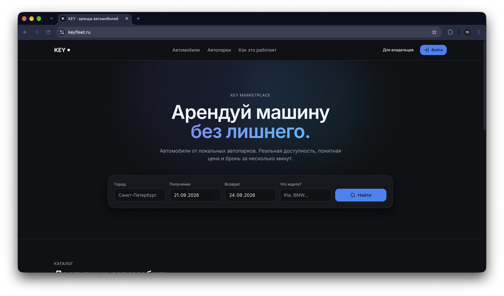
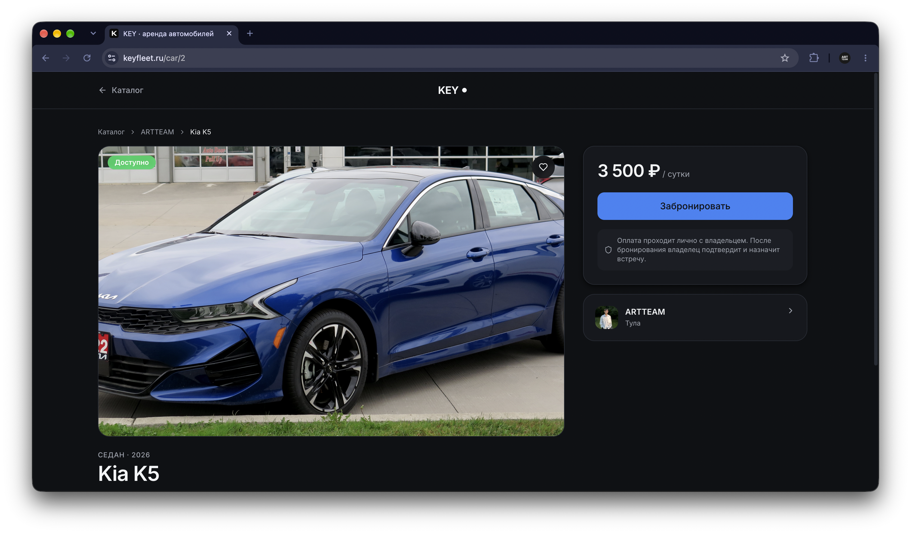
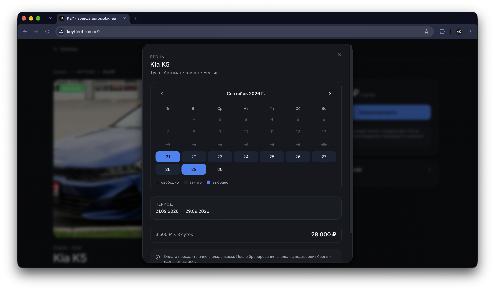
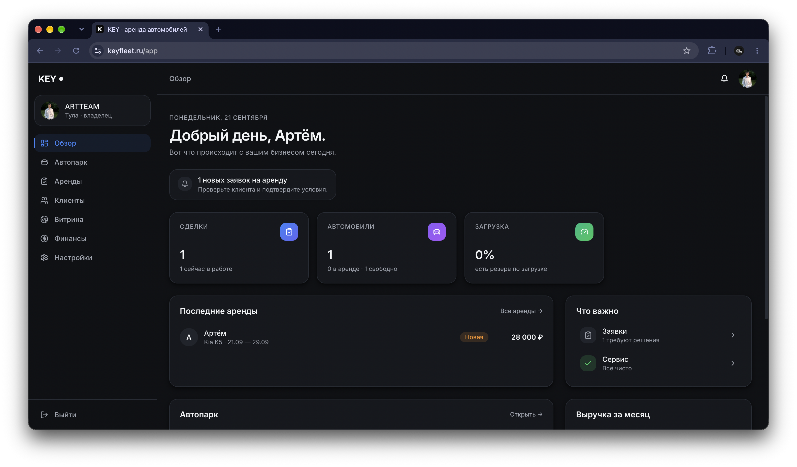
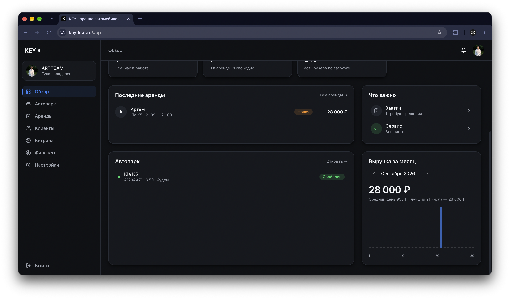
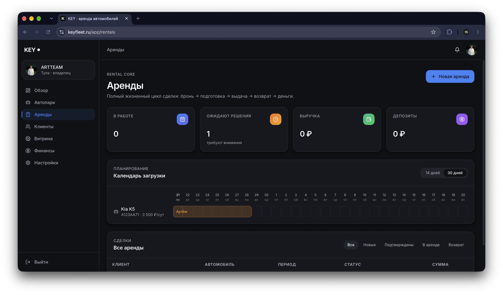
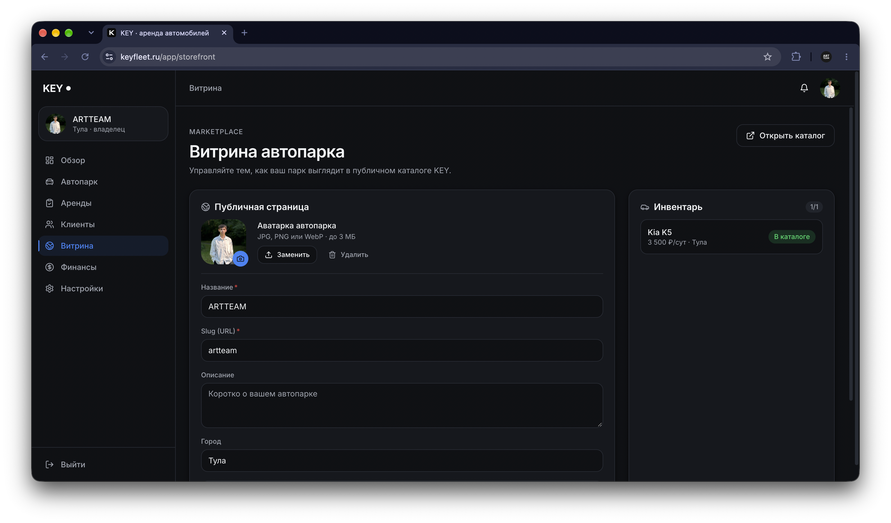

# KEY

Сервис аренды автомобилей от частных автопарков. Публичный маркетплейс для клиентов и рабочее место владельца — в одном продукте.



## Для чего это

Владельцы небольших автопарков обычно ведут аренды в Excel или мессенджерах: теряются заявки, пересекаются даты, непонятно, сколько заработала каждая машина. Клиентам приходится искать через Avito, попадать на устаревшие объявления и уточнять доступность в переписке.

KEY закрывает обе стороны:

- **Клиент** выбирает город и даты, видит только свободные машины и оставляет заявку.
- **Владелец** ведёт весь цикл сделки — от брони до возврата — и сразу видит, сколько денег принесла каждая машина.

## Возможности

### Для клиента

- Поиск по городу, датам и названию модели
- Календарь, который показывает занятые даты конкретной машины
- Заявка на бронирование с выбором диапазона
- Вход и регистрация по коду на email
- История поездок в личном кабинете

### Для владельца

- Добавление машин с фото, характеристиками и тарифом
- Календарь загрузки парка на 14 или 30 дней вперёд
- Полный жизненный цикл сделки: новая → подтверждена → готовится → выдана → возвращена → закрыта
- Осмотры при выдаче и возврате: пробег, уровень топлива, комментарии
- Дополнительные услуги, скидки, штрафы, депозиты
- Финансы по каждой машине — отдельно доходы и расходы
- CRM с историей клиентов и их выручкой
- Публичная витрина автопарка со своей аватаркой и описанием
- Тарифы: Free (до 3 машин), Pro (до 12, 3000 ₽/мес), Business (до 24, 6000 ₽/мес)

## Скриншоты

### Каталог и карточка автомобиля

Поиск по городу и датам, карточки с фото, ценой и характеристиками. При клике — страница машины с галереей, условиями аренды и формой бронирования.




### Бронирование

Календарь показывает занятые даты конкретной машины. Клиент выбирает диапазон, видит итоговую сумму и отправляет заявку владельцу.



### Кабинет владельца

Сводка по парку, выручка за месяц, последние сделки и алерты о том, что требует внимания.




### Аренды и календарь загрузки

Календарь на 14 или 30 дней показывает брони по каждой машине. Ниже — таблица сделок с фильтрами по статусу и быстрыми действиями.



Карточка сделки: прогресс по этапам, статистика, панель операций (осмотр, услуга, продление, депозит) и история событий.


### Витрина автопарка

Публичная страница с названием, городом, аватаркой и списком машин. Владелец сам решает, какие автомобили показывать в каталоге.



### Мобильная версия

Каталог и кабинет владельца адаптированы под мобильные — отдельное меню, тач-интерфейс, корректные поля ввода.

| Каталог | Меню владельца |
|---------|----------------|
|  |  |

## Стек

**Бэкенд**
- Go 1.24, стандартный `net/http` и `ServeMux`
- PostgreSQL 17, драйвер `pgx/v5`
- JWT для сессий, bcrypt для паролей
- Яндекс SMTP для email-кодов
- SMS Aero подключён, но пока не активен

**Фронтенд**
- React 18 и TypeScript
- Vite
- Tailwind CSS и Radix UI
- Framer Motion для анимаций
- TanStack Query для кэша
- Zustand для глобального состояния
- React Hook Form и Zod для форм

**Инфраструктура**
- Docker Compose
- Caddy как reverse proxy с автоматическим HTTPS
- Let's Encrypt для сертификатов

## Архитектура бэкенда

Код разделён по доменам, каждый файл отвечает за свою часть:

```
server/cmd/api/
├── main.go          # только wiring, ~140 строк
├── app.go           # struct App
├── config.go        # переменные окружения, пути
├── types.go         # модели User, Car, RentalTerm
├── middleware.go    # auth, ownerOnly, JWT
├── ratelimit.go     # rate limiter
├── migrations.go    # применение схемы
├── auth.go          # регистрация, вход, email-коды
├── cars.go          # автопарк, фото, финансы
├── rentals.go       # жизненный цикл сделки
├── bookings.go      # заявки с маркетплейса
├── marketplace.go   # публичные эндпоинты
├── fleet.go         # профиль автопарка
├── misc.go          # дашборд, отчёты
├── email.go         # SMTP
└── sms.go           # SMS Aero
```

Фронтенд построен по такому же принципу — `api/`, `features/`, `pages/`, `components/ui/`, `hooks/`, `stores/`.

## Жизненный цикл аренды

Одна сделка проходит через состояния, переходы между которыми контролируются на бэкенде:

```
hold → pending → review → confirmed → preparing → active → returned → completed
                                                  ↘ cancelled
                                                  ↘ rejected
                                                  ↘ expired
```

Переход меняет статус машины (`available` / `rented` / `maintenance`) и пишет событие в историю сделки. Пропустить шаг нельзя — state machine отклонит недопустимый переход.

## Безопасность

- Пароли — bcrypt
- Сессии — JWT (HS256, срок 24 часа)
- Rate limiting на `/auth/*` по IP и по конкретному email или телефону
- Email-коды одноразовые, TTL 5 минут
- Загрузка файлов — проверка Content-Type и magic bytes
- Лимит 10 фото на машину, 3 МБ на аватарку
- `JWT_SECRET` обязателен, приложение не запустится с дефолтом

## Что в планах

- Онлайн-оплата через ЮKassa
- SMS-подтверждение телефона (канал готов, ждёт согласования имени отправителя)
- Push-уведомления владельцу о новых заявках
- Автоматические письма клиенту при смене статуса сделки
- Экспорт отчётов в PDF и Excel
- Мобильное приложение

## Автор

Артём Курочкин
- Email: ArtTeam71@yandex.ru
- Telegram: @artteam71